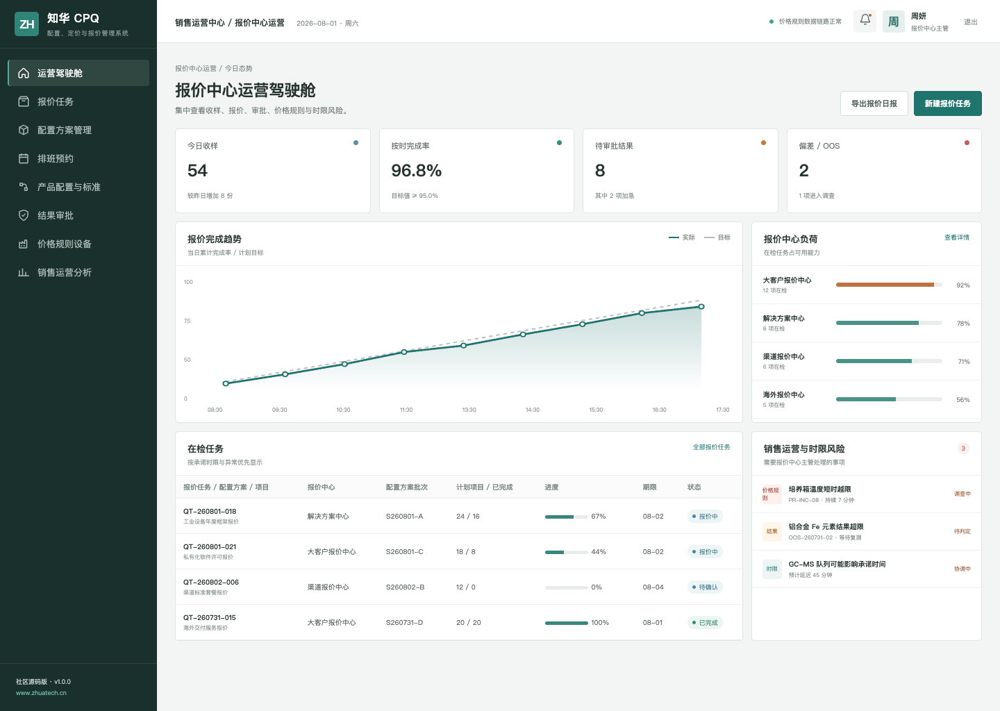
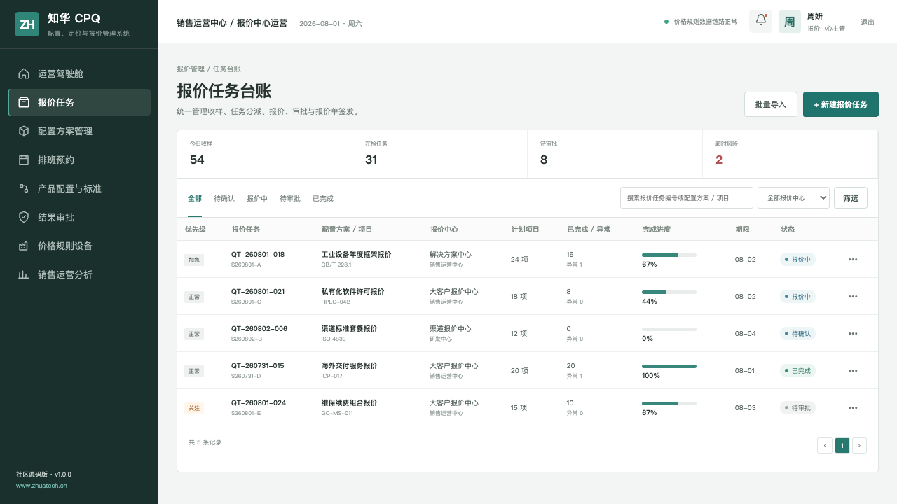
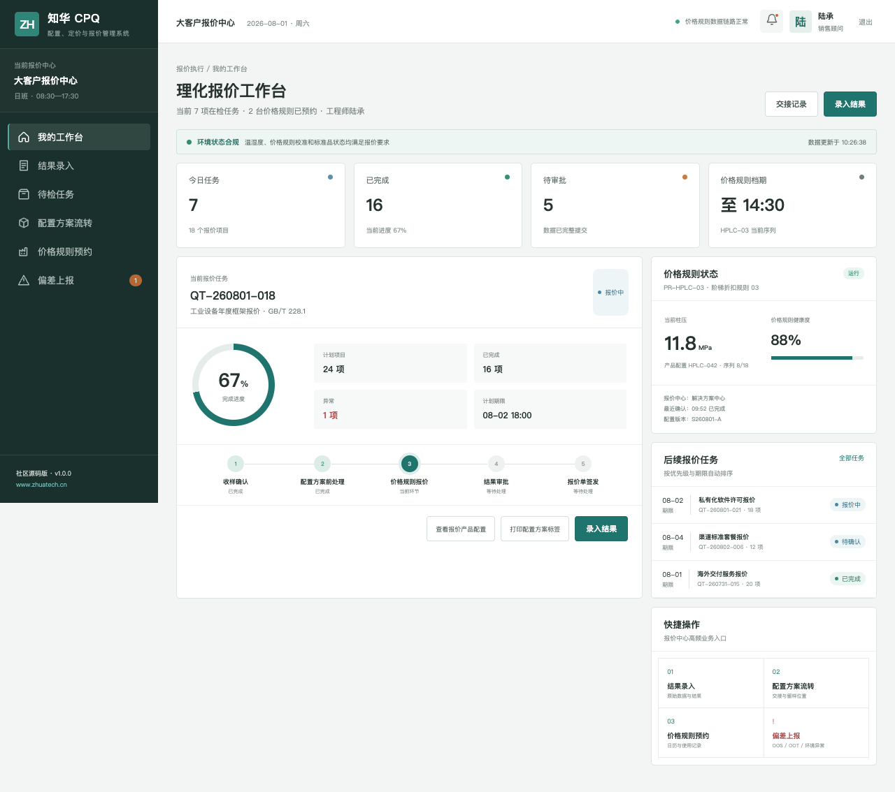

# CPQ 社区源码版：配置、定价与报价管理系统

[](backend/pom.xml) [](frontend/package.json) [](compose.yaml) [](LICENSE)

## 为什么做这套系统

让复杂产品配置、价格规则、审批与报价版本在同一条销售链路上协同。 ZhuaTech CPQ 面向真实企业协作场景，把“商机接入、产品配置、规则计价、毛利校验、报价审批、版本归档”做成一套可运行的前后端分离示例。项目由[知华科技](https://www.zhuatech.cn/)（上海如静知华信息科技有限公司）发布。

## 产品画面

### 定价运营驾驶舱



### 报价管道与版本台账



### 销售顾问报价工作台



## 功能地图

1. 产品目录、配置约束与组合方案
2. 阶梯价、渠道价、折扣与毛利保护
3. 报价审批、版本对比、交付条件与审计

- 端到端流程：商机接入 → 产品配置 → 规则计价 → 毛利校验 → 报价审批 → 版本归档
- 岗位权限：销售顾问、定价经理、审批人、系统管理员
- 管理端与 H5 岗位端共享统一领域数据。

## 技术底座

| 部分 | 技术与职责 |
| --- | --- |
| 后端 | Java 21、Spring Boot、Spring Security、JPA、Flyway |
| 前端 | Vue 3、Pinia、Vue Router、Axios、Vite，响应式管理端与 H5 岗位端 |
| 数据 | MySQL 8；H2 集成测试 |
| 交付 | Docker Compose、Nginx、环境变量配置 |

Java 工程包名为 `cn.zhuatech.cpq`，数据库名为 `zhuatech_cpq`。角色覆盖销售顾问、定价经理、审批人、系统管理员。

## 启动体验

仅看演示界面：

```bash
cd frontend
npm install
npm run dev:demo
```

打开 `http://localhost:5173`。管理端账号 `planner / Demo@2026`，岗位端账号 `operator / Demo@2026`。

完整启动：

```bash
cp .env.example .env
# 修改数据库密码与 JWT_SECRET
docker compose up --build
```

## 数据与安全

仓库中的账号、客户、指标、工单和经营数据均为虚构演示数据。正式落地时应更换默认密码与 JWT 密钥，配置 HTTPS、最小权限、数据库备份、操作审计、脱敏策略，并按照所在行业完成安全与合规评估。

## 使用边界及商业服务

本工程仅允许个人、非商业性的学习、研究和技术交流，**不得商用**。企业内部使用、生产部署、SaaS、客户交付、收费培训、咨询实施及品牌替换，均须事先取得上海如静知华信息科技有限公司书面授权。完整条款见 [LICENSE](LICENSE)。

需要深度开发、私有化部署、系统集成或商业授权，请访问[知华科技官网](https://www.zhuatech.cn/)，也可扫码添加微信咨询：

| 微信咨询 1 | 微信咨询 2 |
| --- | --- |
|  |  |

SEO：CPQ 源码、报价系统、产品配置、价格管理、Java CPQ、Vue CPQ、知华科技开源项目、上海如静知华信息科技有限公司。

## 报价毛利保护

新增 `POST /api/admin/margin-guard`，自动计算折后单价、报价收入和毛利率，并结合折扣权限与交易风险给出自动批准、提交审批或阻断决策，让销售报价在发出前完成利润底线检查。

## 折扣审批自动路由

新增 `POST /api/cpq/insights/discount-approval-routing`，按折扣率、毛利率、交易风险、战略客户和账期自动选择 `AUTO_APPROVE / SALES_MANAGER / SALES_DIRECTOR / FINANCE / EXECUTIVE`，同时返回净报价、折扣金额和完整审批路径。
